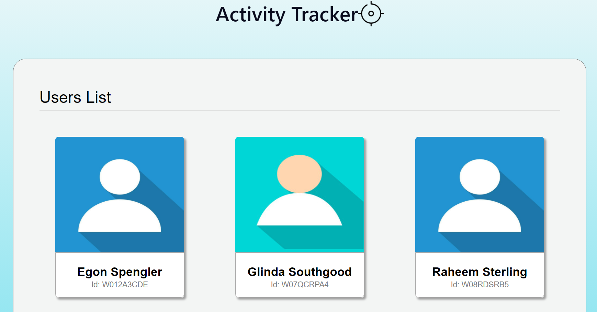

### Overview
This is a simple web application that displays the active time ranges of demo users. You can pick up any date from the built-in calendar and the application will display the time range during which the user was active on that particular day.

### Where to use
The source code can be used as a reference for any project that requires an interface for user and date specific acitivity tracker. The "frontend" folder contains the code for the client-side and the "backend" includes those for the server side.

### Useful link
You can checkout this web app at work in this link- https://activity-time-range.herokuapp.com/

### Tech/Framework used
- ReactJs framework
- Redux
- Axios for handling HTTP requests
- moment for date manipulation
- Express framework for the server

### How it works
Check the following screenshots that will explain various aspects of the app interface-
1. The homepage of the web app displays the available users list in a grid system.

### License
- Copyright 2020 © Anupjyoti Kalita.
