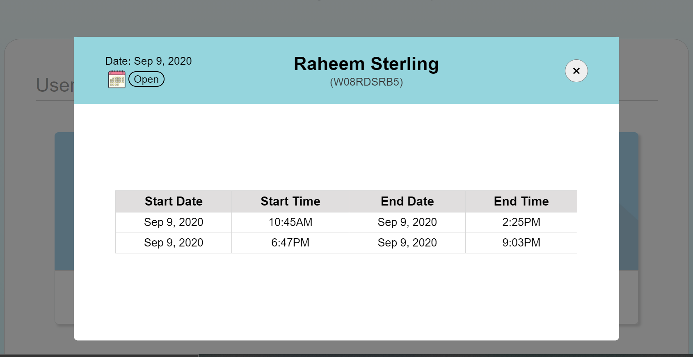
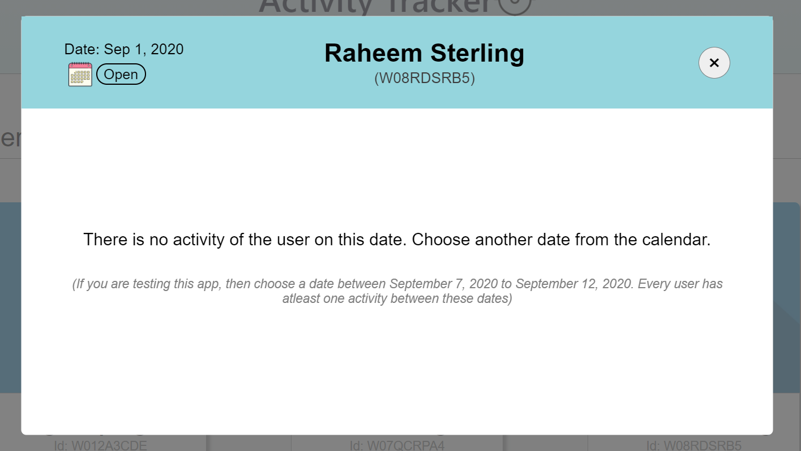
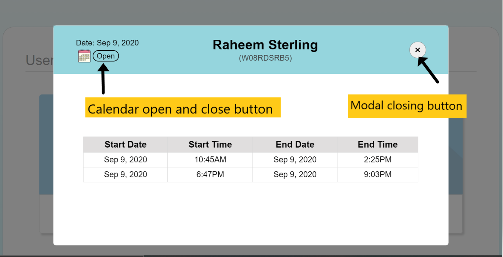
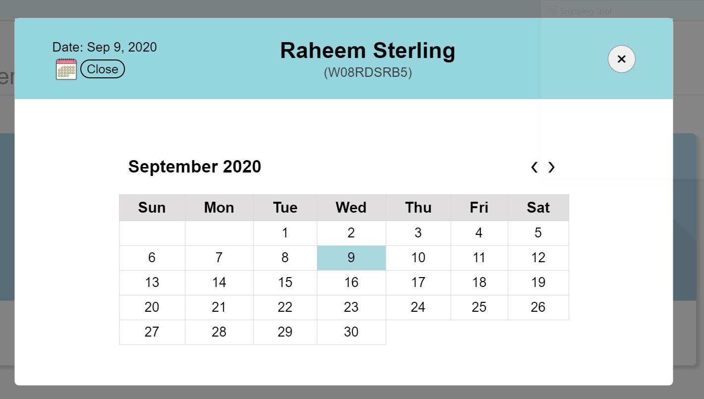
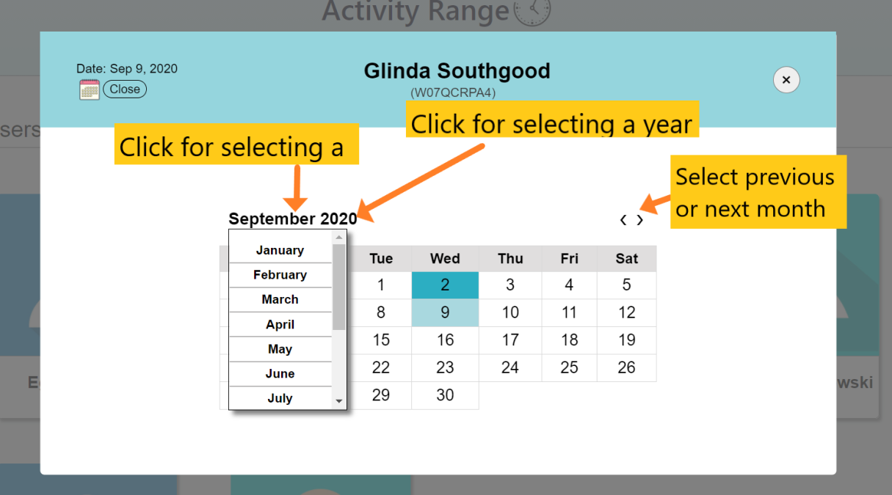

# Active Range
## Overview
This is a simple web application that displays the active time ranges of demo users. You can pick up any date from the built-in calendar and the application will display the time range during which the user was active on that particular day.

## Where to use
The source code can be used as a reference for any project that requires an interface for user and date specific acitivity tracker. The "frontend" folder contains the code for the client-side and the "backend" includes those for the server side.

## Useful link
You can checkout this web app at work in this link- https://activity-time-range.herokuapp.com/

## Tech/Framework used
- ReactJs framework
- Redux
- Axios for handling HTTP requests
- moment for date manipulation
- Express framework for the server

## How it works
Check the following screenshots that will explain various aspects of the app interface-
1. The homepage of the web app displays the available users list in a grid system.

2. On clicking one of the usercards, a modal will show up. It will display the time range on the current day during which the user was active. If he/she was not active during the day, then it will just show an empty message.

3. The modal has two buttons on its header. The right button closes the modal and the left button is used to toggle a calendar to pick a date.

4. Here's how the calendar looks like. You can click on any of the dates to check the active time ranges of that particular user on that particular date.

5. You can click on the month name to select another month. Clicking on the year name will allow you to change the year. There are also two arrow buttons which can be used to go to the previous or next months.

## License
- Copyright 2020 © Anupjyoti Kalita.
